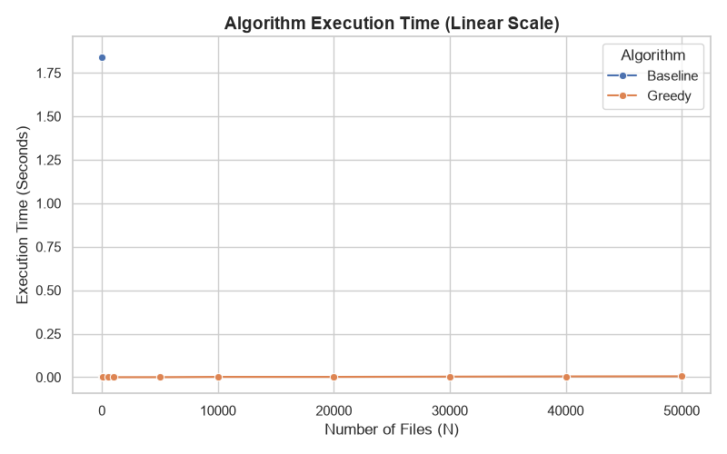
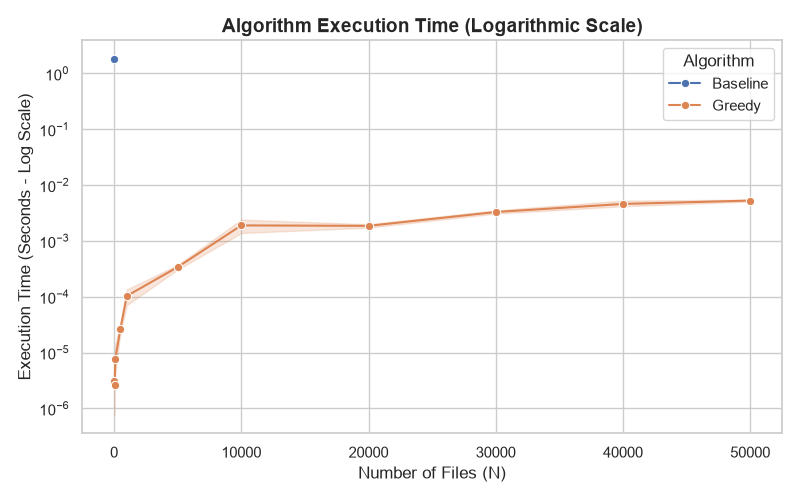

# Empirical Evaluation

## Overview

We implemented two algorithms in [`methods.py`](src/methods.py) to solve the Processing Files problem. Both return an ordering of the files and the minimum average completion time when one file is processed at a time.

1. **Baseline Algorithm:** A brute-force approach that checks every possible permutation of the files, calculates each ordering's average completion time, and keeps the best result.
2. **Proposed Algorithm:** A greedy approach that sorts files from smallest to largest, then calculates the average completion time in a single pass.

The nine unit tests in [`tests.py`](src/tests.py) check cumulative completion times, known optimal results, empty inputs, single files, duplicates, zero sizes, fractional sizes, and preservation of the original input. They also compare the greedy algorithm with the exhaustive baseline on all 121 sequences of length zero through four using sizes from `{0, 1, 3}`, and check the greedy algorithm on 10,000 files. All nine tests pass. For the example `[8, 3, 6, 2]` from [`planning.md`](planning.md), both algorithms return `[2, 3, 6, 8]` with an average completion time of **9.25**.

## Benchmarking Results

The benchmark in [`benchmark.py`](src/benchmark.py) generates random integer file sizes from 1 to 100 (`L = 100`) and varies the number of files from 10 to 50,000. Each algorithm runs five times on the same generated array at each applicable input size, with execution time measured using `perf_counter()`. Input generation and CSV writing occur outside the timed section. These measurements represent the runtime of the ordering algorithms, rather than the time needed to process actual files.

The baseline is restricted to inputs of at most 10 files because its factorial runtime makes larger inputs impractical. Since the smallest benchmark input is 10 files, the recorded results contain only one baseline input size. Both algorithms use the same input at that size.

The table below reports the arithmetic mean of the five recorded runtimes in [`empirical_results.csv`](assests/empirical_results.csv).

| Number of files (n) | Baseline mean time (seconds) | Greedy mean time (seconds) |
| ---: | ---: | ---: |
| 10 | 1.838299767 | 0.000003142 |
| 50 | — | 0.000002667 |
| 100 | — | 0.000007792 |
| 500 | — | 0.000026867 |
| 1,000 | — | 0.000103433 |
| 5,000 | — | 0.000339908 |
| 10,000 | — | 0.001897458 |
| 20,000 | — | 0.001862208 |
| 30,000 | — | 0.003294183 |
| 40,000 | — | 0.004597400 |
| 50,000 | — | 0.005281250 |

A dash indicates that the baseline was not measured at that input size.

## Analysis

- **Baseline factorial cost:** As explained in `planning.md`, the baseline has time complexity **O(n! × n)** because it examines `n!` permutations and spends O(n) calculating the average for each one. At just 10 files, it checks 3,628,800 permutations and takes approximately **1.84 seconds** on average. The single measured input size demonstrates its high cost, but is insufficient to establish an empirical growth curve.
- **Greedy efficiency:** The proposed algorithm has worst-case time complexity **O(n log n)**, dominated by sorting, followed by an O(n) pass to calculate completion times. It processes 50,000 files in approximately **0.00528 seconds (5.28 milliseconds)** on average. The generally increasing runtime remains small across the tested sizes, consistent with the expected scalability of the greedy approach.
- **Comparison at the same input size:** At `n = 10`, dividing the unrounded mean baseline runtime by the mean greedy runtime gives a speedup of approximately **585,000 times**. This ratio describes the recorded measurements and is sensitive to timing variation because the greedy runtime is only a few microseconds. No speedup at 50,000 files can be calculated from this dataset because the baseline was not run at that size.
